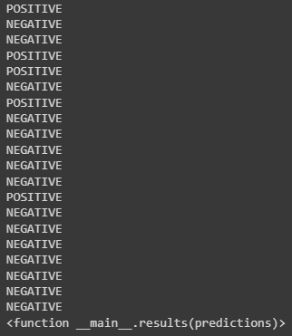

# M3_NLP
Repository for the Natural Language Processing class of the Advanced Artificial Intelligence concentration.


## Description

In this repository you will find the 3 tasks of the Feedback Moment of Module 3 of the Concentration of Advanced Artificial Intelligence.


### Installing
Clone the repository, create the virtual environment, and make sure to install the requirements.
* using: pip install -r requirements.txt


### Executing program
Before running the main "run.py" script, if you want to change the keys for task 3, please go to src/task3.py and change it in lines 13, 14 and 22.

Also, make sure to log in with your HuggingFace account:
* using: huggingface-cli login

Run the main script run.py, it contains everything necessary for the correct execution of the 3 tasks.
* using: py run.py

Tests:
To run tests, from M3_NLP/tests, call any of the scripts. Here is an example:
```
pytest -v test_task1.py
```


### Recommendations
Please make sure you have your own HuggingFace, WandB, Google-Cloud Translate and IBM Watson Language Translator tokens.


### Results Task 1


### Results Task 2
* Loss plots with the full data set:


* View the graphs here: https://wandb.ai/brahmsgife/uncategorized/runs/19oc1xh2?workspace=user-brahmsgife

### Results Task 3


## Author

Abraham Gil Félix
