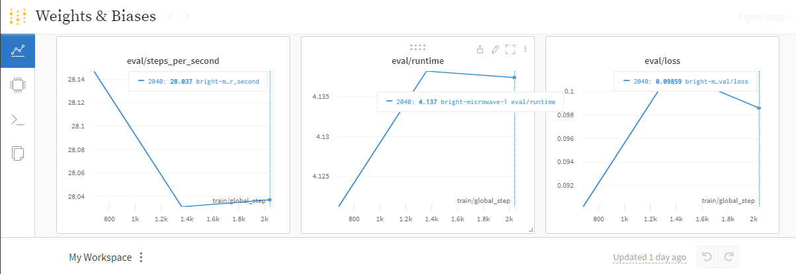

# M3_NLP
Repository for the Natural Language Processing class of the Advanced Artificial Intelligence concentration

## Description

In this repository you will find the 3 tasks of the Feedback Moment of Module 3 of the Concentration of Advanced Artificial Intelligence.

### Installing
Please clone the repository and make sure to install the requirements
* using requirements.txt ;)

### Executing program

Run the script run.py, it contains everything necessary for the correct execution of the 3 tasks.
* using py run.py

### Recommendations
Please make sure you have your own HuggingFace, WandB, Google-Cloud Translate and IBM Watson Language Translator tokens.

* Note: in the case of task 3, please modify the variable "api_key" and "api_url" in line 270.

### Results Task 2

## Author

Abraham Gil Félix
